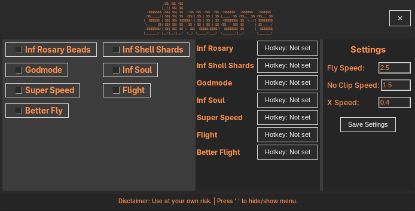

# Silkware - Silksong "Trainer"

A cross-platform "Trainer" for the game *Hollow Knight: Silksong*, built with Python.

## Features

- **Cross-Platform:** Works on both Windows and Linux (Proton Version only).
- **Resource Cheats:** Infinite Rosary Beads, Shell Shards, and Soul.
- **Player Cheats:** Godmode, Super Speed, and Flight.
- **Customizable Settings** 
- **Configurable Hotkeys** 

## Usage (Option A)

### 1. Installation

First, ensure you have Python 3 installed. Then, install the required dependencies:

```sh
pip install -r requirements.txt
```

### 2. Running the Application

To launch the tool, run the `main.py` script:

```sh
python3 main.py
```

## Usage (Option B)


Use the precompiled Binaries from the Releases Section (Soon to come!)

## Build it yourself

To build the executable yourself, follow these steps:

1.  **Clone the repository:**

    ```sh
    git clone https://github.com/your-repo/Silkware-SilksongCheat.git
    cd Silkware-SilksongCheat
    ```

2.  **Set up a virtual environment and install dependencies:**

    ```sh
    python3 -m venv venv
    source venv/bin/activate  # On Windows, use `venv\Scripts\activate`
    pip install -r requirements.txt
    ```

3.  **Build the executable:**

    *   **On Linux:**

        ```sh
        ./build-linux.sh
        ```

    *   **On Windows:**

        ```cmd
        build-windows.bat
        ```

    Just follow the steps the script tells you anyways.

## Current Issues

- **Better Flight** is very experimental and doesn't exactly work too well

</br>

### Disclaimer

This tool modifies game memory and is intended for educational purposes and personal use only. Use at your own risk. The developers are not responsible for any game crashes, corrupted save files, or other adverse effects.